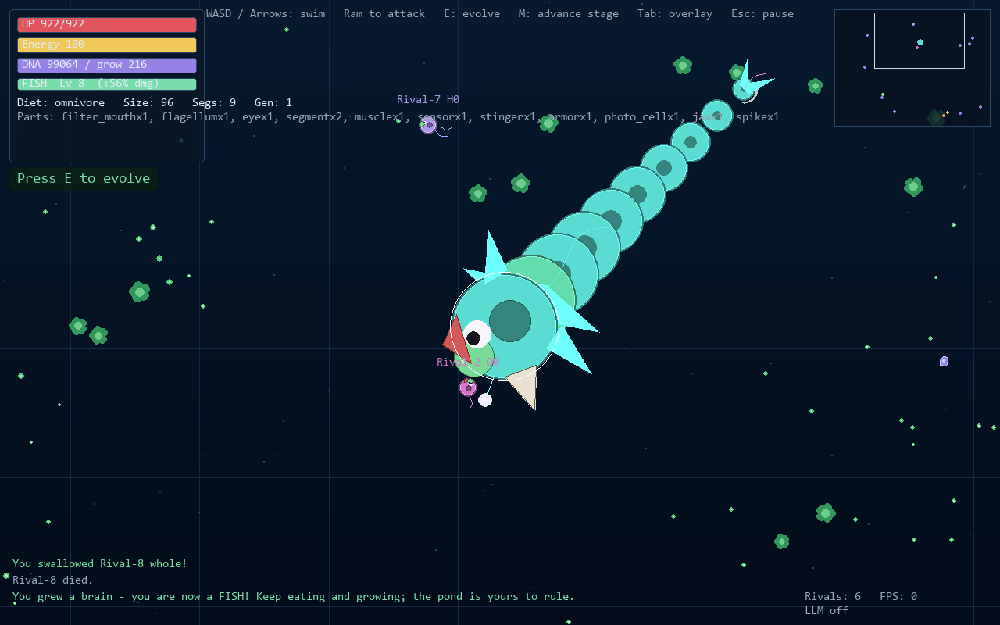
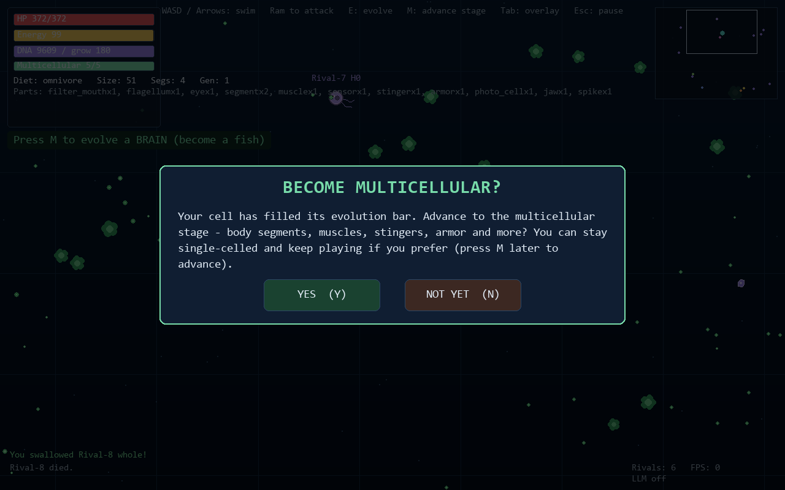
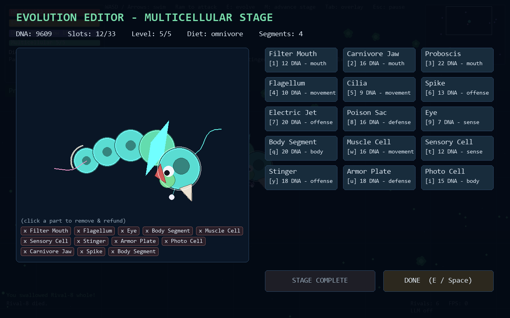

# Evolved

A 2D top-down **evolution game** inspired by the opening water stage of *Spore*, written in
Python/pygame. You start as a single microscopic cell in a primordial pond. Eat, survive, bank DNA,
bolt on organelles in the evolution editor, and climb the ladder:

**single cell → multicellular organism → fish.**

There is no leaving the pond. The fish stage is the endless endgame — every level of DNA makes you
larger, tougher, and harder-hitting, forever.

You are not alone in the water: rival organisms are driven by a **local LLM** (Ollama / `qwen3:4b`)
and play the same game you do — they choose whether to hunt, harvest, or both, they forage and flee,
they buy parts, they grow, and they climb the same three stages. Late game, the pond belongs to
whichever apex fish out-evolved the others. Ideally you.

All graphics are **drawn procedurally in Python** — no image assets, nothing to license. Everything
you see is shapes and math at runtime.



---

## Table of contents

- [Install](#install)
- [Quick start](#quick-start)
- [Startup options](#startup-options)
- [Controls](#controls)
- [How the game works](#how-the-game-works)
  - [The loop](#the-loop)
  - [The three stages](#the-three-stages)
  - [Diets](#diets)
  - [Food](#food)
  - [Parts catalog](#parts-catalog)
  - [Combat](#combat)
- [The LLM rivals](#the-llm-rivals)
- [Project layout](#project-layout)
- [Tuning](#tuning)
- [Troubleshooting](#troubleshooting)
- [Credits](#credits)

---

## Install

Requires **Python 3.11+** (tested on 3.14). Dependencies are
[`pygame-ce`](https://pyga.me/) and [`requests`](https://pypi.org/project/requests/):

```bash
python -m pip install -r requirements.txt
```

## Quick start

```bash
python main.py
```

That's it — you spawn as a herbivore cell with a filter mouth, a flagellum, and an eye.
Swim into green plant chunks to eat. When the HUD says **Press E to evolve**, press `E`,
swim into the mate that appears, and spend your DNA.

## Startup options

```
python main.py [options]
```

| Option | Default | What it does |
|---|---|---|
| `--ollama-host HOST` | `192.168.15.38` | Hostname/IP of the Ollama server that drives rival brains. |
| `--ollama-port PORT` | `21434` | Port of the Ollama server. |
| `--model NAME` | `qwen3:4b` | Ollama model used for rival strategy. Any JSON-capable chat model works. |
| `--no-llm` | off | Disable the LLM entirely. Rivals run on pure heuristics — still competent, less varied. |
| `--ai-cells N` | `10` | Number of rival organisms. The world keeps at least 6 alive, respawning newcomers. |
| `--demo` | off | Start with **autopilot** already on (same as pressing `P` immediately). Good for watching the ecosystem run itself. |
| `--screenshot PATH` | — | Headless mode: simulate `--frames` frames without a window, save a gameplay PNG to `PATH` plus an editor PNG to `PATH_editor.png`, then exit. Used for testing/CI. |
| `--frames N` | `300` | How many frames to simulate before `--screenshot` captures. |
| `--autoquit SECONDS` | `0` (off) | Close the window automatically after N seconds. Used for smoke tests. |

Environment variables:

| Variable | Effect |
|---|---|
| `EVOLVED_DEBUG=1` | On exit, print LLM request statistics and a final player/rival summary to the console. |

Examples:

```bash
python main.py --ai-cells 10                 # a crowded pond
python main.py --no-llm                      # offline / no Ollama available
python main.py --model qwen2.5:7b            # try a different local model
python main.py --demo --ai-cells 10          # sit back and watch evolution happen
python main.py --screenshot shot.png --frames 2000   # headless render after ~33s of sim
```

## Controls

| Input | Action |
|---|---|
| `W` `A` `S` `D` / Arrow keys | Swim. Your organism turns toward the held direction and accelerates. |
| *(ram another organism)* | Attack on collision — automatic, using whatever offense you have (jaw, spikes, stingers, poison...). |
| `E` | Call a mate. Swim into it to reproduce, which opens the **Evolution Editor**. (Press `E` again to skip the swim.) |
| `M` | Advance to the next stage, any time your evolution bar is full. |
| `P` | Toggle **autopilot**: the AI plays your organism (using the LLM when connected, heuristics otherwise) — it forages, fights, evolves, answers stage prompts, and auto-retries 2 s after death. Press again to take back control. |
| `Y` / `N` | Answer a stage-advancement question. |
| `1`–`9`, `Q W T Y U I` | (Editor) buy parts by hotkey. |
| `Space` / `E` / `Esc` | (Editor) close and return to the pond. |
| `Tab` | Toggle the overhead overlay (name, health bar, and HP/total for every organism, yours included). |
| `R` | (After death) start a new run. |
| `Esc` | Pause / resume; quit from pause or death screens. |

Eating is automatic — swim your mouth into food you can digest.

## How the game works

### The loop

**EAT → DNA → EVOLVE → GROW → ADVANCE.** Everything you eat pays out DNA (the currency) and
energy (your metabolism). In the editor you spend DNA on parts and on **GROW**, which raises your
level, size, health, and part slots. Filling a stage's five-level bar puts the next stage on offer.

Energy drains constantly (faster while swimming); running empty starves your health down, and eating
well regenerates it. If your health hits zero you die and burst into meat chunks — and so does
everyone else. Death is a restart (`R`).

### The three stages

| Stage | How you get there | What it plays like |
|---|---|---|
| **Cell** | You start here. | Classic microbe life: dodge bigger cells, eat what your mouth allows, collect part meteors, grow five levels. |
| **Multicellular** | Fill the cell bar → the game **asks** (yes/no). | You sprout a chain of trailing body segments and unlock tissue parts: segments, muscles, sensors, stingers, armor, photo cells. Bigger foods (algae) open up, much smaller prey can be swallowed whole, and your head generates **suction** — edible food within 2× your head radius is pulled into your mouth. |
| **Fish** | Fill the multicellular bar → choose to **evolve a brain**. | The endless endgame. Pectoral fins, a forked tail, and no level cap: each level costs more DNA and grants more size (up to a cap), more health, and **+7% outgoing damage — uncapped, forever**. |

Stage advancement is always **your choice**:



Answer **NOT YET** and you keep playing the current stage indefinitely — the offer stays available
on `M` whenever you're ready. Rivals advance on their own schedule (multicellular rivals wear a `*`,
fish rivals a `FISH` badge).

### Diets

Your mouth parts determine your diet, and your diet determines your food:

| Diet | Mouths | Eats | Playstyle |
|---|---|---|---|
| **Herbivore** | Filter Mouth | plants, algae | Safest income, no bite — defend with spikes/poison or outrun trouble. |
| **Carnivore** | Jaw | meat, smaller organisms | The jaw is mouth *and* weapon. Hunt prey, crack kills into meat. |
| **Omnivore** | Jaw + Filter, or Proboscis | everything | Twice the food sources, fastest progression, costs more slots/DNA. |

### Food

| Food | Looks like | DNA | Energy | Notes |
|---|---|---|---|---|
| Plant | small green mote | 2.4 | 13 | Everywhere; constantly restocked. |
| Meat | red chunk | 3.2 | 19 | Dropped by deaths; decays after ~22 s. |
| Algae | large green cluster | 7 | 34 | Plant-eaters only, and you must be size 24+ (late cell stage or beyond). |
| Part meteor | purple shard | 11 | 8 | Anyone can crack one: bonus DNA **and it unlocks a random part** you may not have earned yet. |
| Smaller organisms | — | varies | varies | Bite them down, or swallow whole anything under ~45% of your size (carnivore/omnivore). |

### Parts catalog

Bought in the editor with DNA; attached parts show as grouped chips ("25x Stinger") and clicking a
chip removes one of that part with a full refund. Slots come from your level, your body segments,
and every stage you've completed (slots never regress). **Duplicates stack**: every extra jaw, spike,
stinger, poison sac, and electric jet adds damage as `n^0.75` — always worth more, never linear.
*Unlock* is the growth level within the part's stage; part meteors can unlock things early.

**Cell-stage parts** (available forever):

| Part | Cost | Unlock | Effect |
|---|---|---|---|
| Filter Mouth | 12 | 0 | Herbivore mouth: eat plants and algae. |
| Carnivore Jaw | 16 | 0 | Carnivore mouth: eat meat; bite smaller organisms (34 dmg/s). |
| Proboscis | 22 | 3 | Omnivore mouth: plants *and* meat in one part. |
| Flagellum | 10 | 0 | +58 top speed. |
| Cilia | 9 | 2 | +2.6 rad/s turn rate. |
| Spike | 13 | 1 | 26 dmg/s per facing spike; every spike counts (diminishing returns). Hurts rammers too. |
| Electric Jet | 20 | 4 | Automatic shock pulse: 22 dmg within 95 px every 1.6 s. Extra jets widen the radius and raise the damage, both with diminishing returns. |
| Poison Sac | 16 | 2 | Toxic aura: 18 dmg/s to anything touching you. |
| Eye | 7 | 0 | +150 perception range (matters for AI; a bigger minimap read for you). |

**Multicellular-stage parts** (multicellular and fish):

| Part | Cost | Unlock | Effect |
|---|---|---|---|
| Body Segment | 20 | 0 | +1 trailing body cell: +32 max health, +2 part slots. |
| Muscle Cell | 16 | 0 | +46 speed, +0.6 turn. Renders as flapping fins. |
| Sensory Cell | 12 | 0 | +210 perception range. |
| Stinger | 18 | 1 | 30 dmg/s on any contact, no facing needed; stacks with diminishing returns. |
| Armor Plate | 18 | 1 | Incoming damage ×0.84 per plate (floors at 30%). |
| Photo Cell | 15 | 2 | +1.5 energy/s from photosynthesis — offsets your metabolism. |

### Combat

Combat is collision-driven: swim into another organism and every applicable effect resolves
continuously — jaw bites (if they're your size or smaller), facing spikes, stingers, poison auras —
while electric jets pulse on their own timer. Damage passes through the defender's armor multiplier;
fish apply their level-scaled damage bonus to everything they deal. Prey under ~45% of your size is
**swallowed whole** (instant kill, no meat left). Anything else that dies bursts into meat chunks.
Size is the master variable: growing turns yesterday's predator into today's snack.

**Tails are attackable.** Body segments are part of your hitbox: anything that catches your trailing
tail can chew it (bites ignore the size gate on tails, at half damage — even small scavengers can
gnaw on a giant), so a long body is reach, health, and slots *and* a liability. Tail hits land at
reduced effect, and the tail fights back: stingers and poison on the defender punish whoever is
chewing. Guard your tail or armor it — and harass bigger organisms from behind.

## The LLM rivals

Rival organisms are steered by a local LLM through Ollama (default `http://192.168.15.38:21434`,
model `qwen3:4b`):

- **At spawn**, each rival sends the model a snapshot of its surroundings and asks one question:
  *hunt, harvest, or both?* The answer (carnivore / herbivore / omnivore) decides its starting mouth.
  The event log announces each choice.
- **Every ~6 seconds** afterward, each rival asks for a strategy refresh: a goal
  (forage / hunt / flee / wander), a diet to work toward, a part wishlist, and whether to grow.
- **Every frame**, fast heuristics execute the current plan — steering, fleeing reflexes, hunger
  overrides, purchases, growth, and stage advancement. The model sets direction; the code drives.

Requests run on four background worker threads with timeouts, so the game **never** blocks on the
model. If Ollama is unreachable at launch (or you pass `--no-llm`), rivals fall back to pure
heuristics and the HUD shows `LLM off`. The HUD's `LLM ok:N fail:N` counter tracks live requests.



## Project layout

```
main.py                entry point / CLI parsing
requirements.txt       pygame-ce, requests
evolved/
  config.py            every tuning constant and color in one place
  parts.py             the part catalog: costs, unlock levels, stages
  cell.py              the organism: stats, parts, stages, segments, rendering
  entities.py          plants, meat, algae, part meteors
  world.py             spawning, eating, combat resolution, deaths, restocking
  ai.py                rival brains: LLM policy + per-frame heuristics
  llm.py               Ollama client + threaded request manager
  player.py            keyboard → thrust
  camera.py            follow camera with size-aware zoom
  editor.py            the evolution editor UI
  hud.py               HUD, minimap, event log, water background
  game.py              game states, stage prompts, main loop, screenshot harness
docs/                  README screenshots
```

## Tuning

Nearly every number in the game — speeds, damage, costs, food density, world size, stage pacing —
lives in [`evolved/config.py`](evolved/config.py) with a comment. Want a bigger pond, cheaper
growth, meaner poison, or a 20-rival free-for-all? Edit one file.

## Troubleshooting

- **`LLM off` in the HUD** — Ollama wasn't reachable at launch. Check the host/port
  (`--ollama-host`, `--ollama-port`), confirm the model is pulled (`ollama list`), or play with
  `--no-llm`. The game is fully playable either way.
- **Rivals all picked the same strategy** — the model chooses from what it sees; a pond full of
  plants at spawn makes harvesting genuinely attractive. Variety grows as meat enters the ecosystem.
- **Slow first LLM answers** — cold model load on the Ollama side. Rivals fall back to a random
  diet after 8 s and honor the model from the next refresh onward.
- **Window doesn't open over SSH/headless** — use `--screenshot out.png` for headless runs; it sets
  SDL's dummy video driver automatically.

## Credits

Design inspired by the Cell Stage of *Spore* (Maxis, 2008). This is an original, non-commercial fan
reimplementation; no assets from the original game are used. All art is procedural. MIT licensed.
